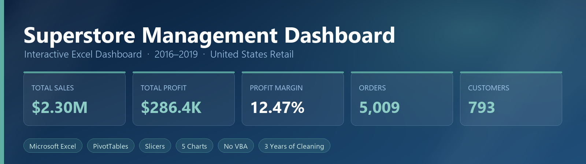
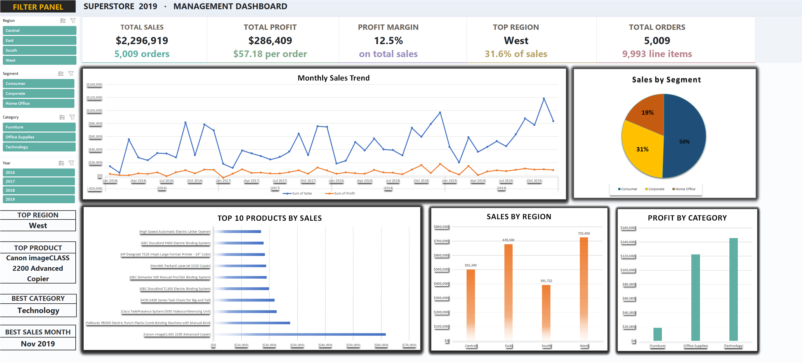
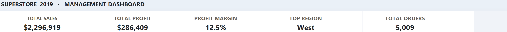
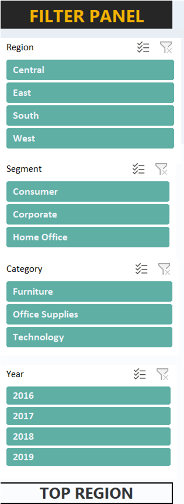
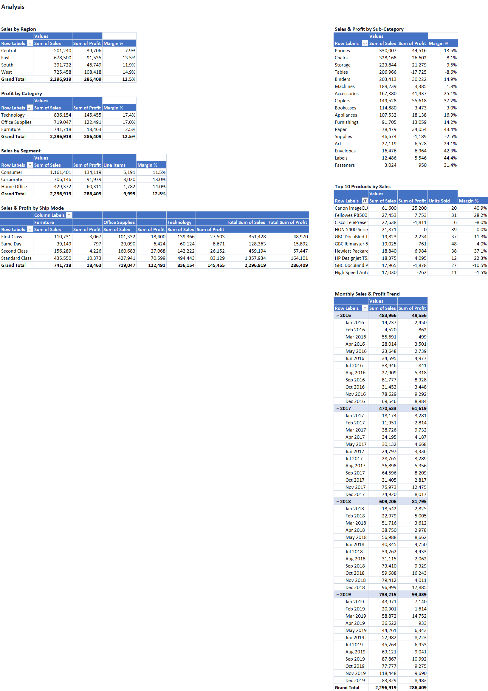

---

## 📋 About

An interactive **Microsoft Excel** management dashboard for a US superstore chain, analysing **four years** of retail transactions (**2016–2019**).

The workbook is a complete **Data Cleaning → Analysis → Dashboard** pipeline delivered as a single `.xlsx` file — **no macros, no external tools**, just native Excel features.

| | |
|---|---|
| **Line items** | 9,993 |
| **Unique orders** | 5,009 |
| **Unique customers** | 793 |
| **Total sales** | $2,296,919.49 |
| **Total profit** | $286,409.08 |
| **Profit margin** | 12.47% |
| **Reporting period** | 2016-01-03 → 2019-12-30 |

> **Tool:** Microsoft Excel (Excel Tables, PivotTables, Slicers, Conditional Formatting, Charts)
> **Data source:** Kaggle — *Superstore Sales Dataset*

---

## 📸 Dashboard Preview

The `SUPERSTORE DASHBOARD` sheet is the executive view. Everything on it is **live** — slicer selections propagate through every KPI card, chart, and pivot table instantly.



### KPI Cards

Five headline metrics, each with supporting context.



### Filter Panel — Interactive Slicers

Four slicers (**Region · Segment · Category · Year**) drive the entire dashboard. Click any value to filter; Ctrl+click to multi-select.



| Slicer | Options | Effect |
|--------|---------|--------|
| **Region** | West · East · Central · South | Filters every KPI, chart and pivot |
| **Segment** | Consumer · Corporate · Home Office | Segments the customer base |
| **Category** | Technology · Furniture · Office Supplies | Drills into product lines |
| **Year** | 2016 · 2017 · 2018 · 2019 | Compares performance over time |

### Analysis Sheet

Seven PivotTable analyses backing the dashboard visuals — sales and profit by region, category, segment, ship mode, and sub-category, plus a top-10 product ranking and a monthly trend.



1. Sales by Region (with margin %)
2. Profit by Category
3. Sales by Segment
4. Sales & Profit by Ship Mode (cross-tabbed by category)
5. Sales & Profit by Sub-Category
6. Top 10 Products by Sales (with units sold & margin)
7. Monthly Sales & Profit Trend (2016–2019)

---

## 📄 Workbook Structure (5 Sheets)

### Sheet 1 — `Raw Data`
The untouched source: **9,994 rows × 21 columns** of transactional records, formatted as a native **Excel Table** (`tblRawData`). Covers order identity, dates, ship mode, customer geography, product hierarchy, and the `Sales` / `Quantity` / `Discount` / `Profit` measures.

### Sheet 2 — `Clean Data`
**9,993 rows** — one duplicate removed — with **5 engineered columns** appended:

| Derived Column | Purpose |
|----------------|---------|
| `Profit Margin` | Profit ÷ Sales |
| `Sales Category` | High / Medium / Low sales banding |
| `Profit Status` | Profit / Loss flag |
| `Year` | Order year (2016–2019) |
| `Year-Month` | Monthly bucket for trend analysis |

Stored as a native Excel Table (`tblCleanData`) so downstream PivotTables auto-expand when rows are added.

### Sheet 3 — `SUPERSTORE DASHBOARD`
The executive view: **5 KPI cards**, **5 charts**, a **4-slicer Filter Panel**, and 4 highlight cards (Top Region, Top Product, Best Category, Best Sales Month).

### Sheet 4 — `Analysis`
The seven PivotTable analyses listed above.

### Sheet 5 — `Dashboard Data`
PivotTable caches and helper ranges that feed the dashboard charts.

---

## 📈 Results

### By Region

| Region | Sales | Profit | Margin % |
|--------|------:|-------:|---------:|
| West | $725,457.82 | $108,418.45 | **14.94%** |
| East | $678,499.87 | $91,534.84 | 13.49% |
| Central | $501,239.89 | $39,706.36 | 7.92% |
| South | $391,721.91 | $46,749.43 | 11.93% |

### By Category

| Category | Sales | Profit | Margin % |
|----------|------:|-------:|---------:|
| Technology | $836,154.03 | $145,454.95 | 17.40% |
| Furniture | $741,718.42 | $18,463.33 | **2.49%** |
| Office Supplies | $719,047.03 | $122,490.80 | 17.04% |

### By Segment

| Segment | Sales | Profit | Margin % | Line Items |
|---------|------:|-------:|---------:|-----------:|
| Consumer | $1,161,401.34 | $134,119.21 | 11.55% | 5,191 |
| Corporate | $706,146.37 | $91,979.13 | 13.03% | 3,020 |
| Home Office | $429,371.78 | $60,310.74 | 14.05% | 1,782 |

---

## 🧠 Key Insights

Findings surfaced by the dashboard:

- **Furniture is the profit sink.** It posts the **2nd-highest revenue** ($741.7K) but yields only a **2.49% margin** ($18.5K) — roughly one-eighth of Technology's margin on comparable revenue.
- **Tables lose money.** `Tables` is the worst sub-category at **−$17,725.48 profit (−8.56% margin)**, alongside loss-making `Bookcases` and `Supplies`.
- **Discounting is the root cause.** Average discount is **15.6%**, and **52% of all line items** are discounted — heavily discounted lines are exactly where margins collapse.
- **Copiers and Paper are the profit engines.** `Copiers` (**37.20%**) and `Paper` (**43.39%**) post the healthiest margins despite mid-tier revenue.
- **West leads on both revenue and margin** (14.94%), while **Central** is margin-poor at 7.92% on $501K of sales.
- **Smaller segments are more profitable.** Home Office (14.05%) beats Consumer (11.55%) on margin.

---

## 🚀 Getting Started

1. **Download** [`Superstore 2019.xlsx`](Superstore%202019.xlsx) (3.7 MB).
2. Open it in **Microsoft Excel 2016 or later** — slicers require Excel 2013+.
3. Go to the **`SUPERSTORE DASHBOARD`** sheet.
4. Use the **Filter Panel** to slice by region, segment, category, or year — every KPI and chart updates live.

> ⚠️ The workbook contains **no VBA**. If Excel prompts about macros, choose **No** — nothing is lost.

---

## 📦 Repository Structure

```text
superstore-management-dashboard/
├── Superstore 2019.xlsx        # Main workbook (5 sheets)
├── images/
│   ├── banner.png              # Project banner
│   ├── dashboard.png           # Full dashboard
│   ├── kpi-cards.png           # KPI card strip
│   ├── filter-panel.png        # Slicer filter panel
│   └── analysis.png            # Analysis sheet
└── README.md                   # Project documentation
```

---

## 📑 Data Source & Credits

This project uses the widely available **[Superstore Sales Dataset](https://www.kaggle.com/datasets/vediarya/superstore-sales-dataset)** published on Kaggle — a sample retail transaction dataset. Credit for the underlying dataset belongs to its original author.

The **cleaning logic, derived columns, PivotTable analysis, slicer configuration, and dashboard design** in this repository are original work.

---

## 🔗 Connect

- **Author:** Mohamed Hany
- **LinkedIn:** [Mohamed Hany Abdelfattah](https://www.linkedin.com/in/mohamed-hany-abdelfattah/)
- **GitHub:** [Mohamed-Hany-Abdelfattah](https://github.com/Mohamed-Hany-Abdelfattah/)

---

**Built by [Mohamed Hany Abdelfattah](https://github.com/Mohamed-Hany-Abdelfattah/)** — © 2026
